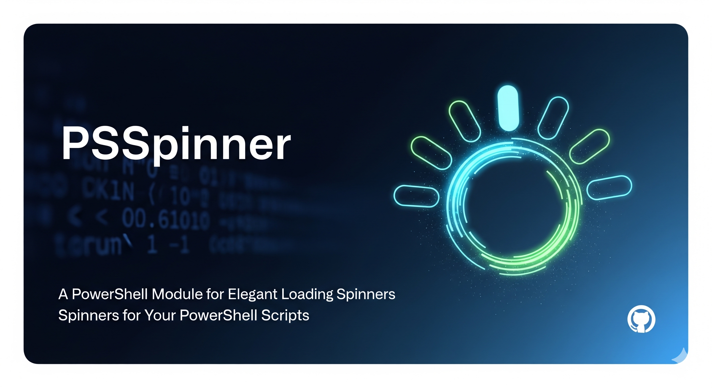

# PSSpinner




[](https://github.com/baldator/PSSpinner/commits/main)
[](https://github.com/baldator/PSSpinner/actions)
[](https://www.powershellgallery.com/packages/PSSpinner)

A small PowerShell helper that displays a CLI spinner while running a script block in the background.

- Runs the provided `ScriptBlock` in a background runspace so the main thread can render a smooth spinner.
- Returns the output of the `ScriptBlock` and surfaces any errors.

## Files

- [Public/Invoke-Spinner.ps1](Public/Invoke-Spinner.ps1) — main spinner function `Invoke-Spinner`.
- PSSpinner.psm1 / PSSpinner.psd1 — module manifest and module file (load as a module).
- [Tests/PSSpinner.Tests.ps1](Tests/PSSpinner.Tests.ps1) — Pester tests.

## Installation / Loading

Dot-source or import the module from the repository root.

```powershell
# Import module directly
Import-Module .\PSSpinner.psm1

# Or dot-source the function (for quick testing)
. .\Public\Invoke-Spinner.ps1
```

## Usage

Example: run a short task while showing a spinner and capture the result.

```powershell
$result = Invoke-Spinner -Message "Working..." -ScriptBlock {
    Start-Sleep -Seconds 2
    return "Done"
}

Write-Host "Result: $result"
```

If you imported the module, `Invoke-Spinner` will be available as a normal cmdlet/function.

## Running Tests

This repo includes Pester tests. From the repository root run:

```powershell
Invoke-Pester ./Tests
```

## Contributing

Contributions, bug reports, and PRs are welcome. Please open an issue for major changes.

## Timeout

- **Parameter**: `-TimeoutSeconds` — optional integer (seconds). Default: `0` (disabled). If the timeout elapses the background runspace is stopped and `Invoke-Spinner` throws a `System.TimeoutException`.

## License

MIT — feel free to reuse and modify.
